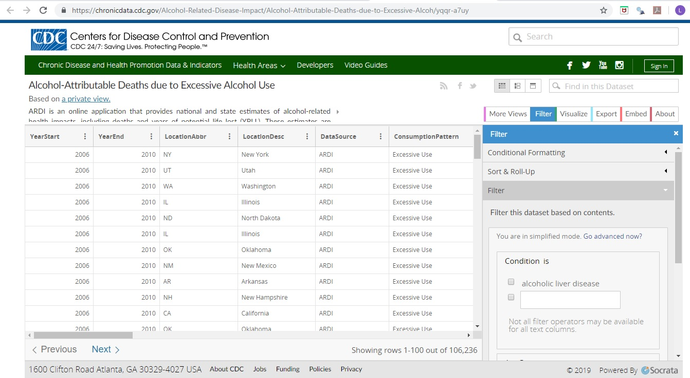

Leland Randles 
Final Project Documentation 
DATA608 – Spring 2019 

<b>Data Sources</b>

Downloaded data set from https://chronicdata.cdc.gov/Alcohol-Related-Disease-Impact/Alcohol-Attributable-Deaths-due-to-Excessive-Alcoh/yqqr-a7uy by clicking on the “Export” tab on the right pane and choosing “CSV for Excel”. After download I committed it to my GitHub report for the course in the “Final_Project” folder: https://raw.githubusercontent.com/LelandoSupreme/DATA608/master/Final_Project/Alcohol-Attributable_Deaths_due_to_Excessive_Alcohol_Use.csv
 

For a data dictionary and observations regarding how to use the data, refer to the “CDC_EDA.xlsx” file in my GitHub repository for the project. The primary consideration with this dataset is that some rows duplicate information in other rows, so you have to decide whether you want to include them as an option within the drop-downs (but then exclude them from totals), or whether you want to filter them out altogether. For example, in addition to rows for each state, there is a US row, where the totals are the same as the sum of the rows for each individual state. If you include it as an option, you need to exclude it if you sum rows to get a national total. Or you can exclude it and general national numbers by summing the state rows.
Downloaded 2010 Census population data from census.gov’s FactFinder search utility: https://factfinder.census.gov/faces/tableservices/jsf/pages/productview.xhtml?pid=ACS_10_5YR_S0101&prodType=table
 

    

<b>Data Handling</b>

All data handling is documented in the comments of the app.R file. The primary challenge was marrying the cdc dataset to the census dataset. The datasets were merged by State, Sex and AgeGroup. The states used the exact same descriptions in both datasets, but the sex codes were not the same and the age ranges were different. Luckily, the age ranges overlapped in a way that worked (0-19 on cdc file could be matched to sum of 0-4, 5-9, 10-14 and 15-19 from census file). The exception was for under 21 and over 21, where I had to use pro-rating (assuming 40% of 20-24 age range is 20-21 and 60% is 22-24). 
 

    

